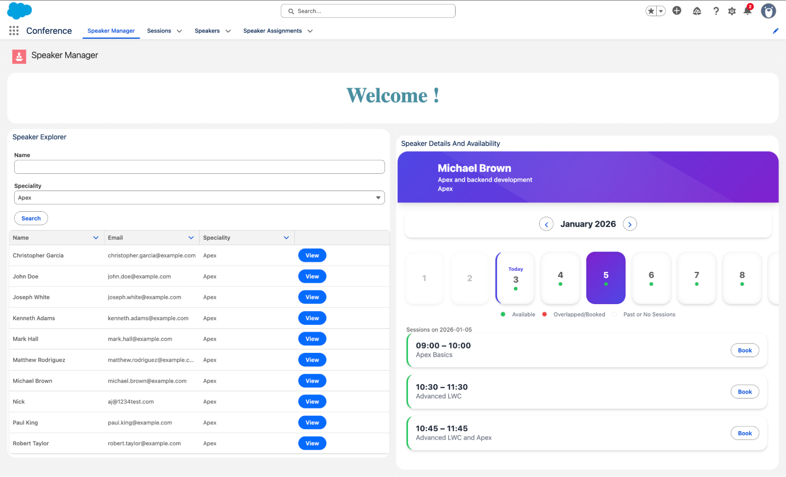
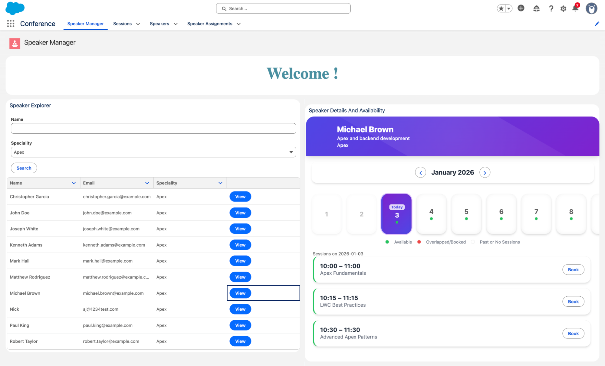
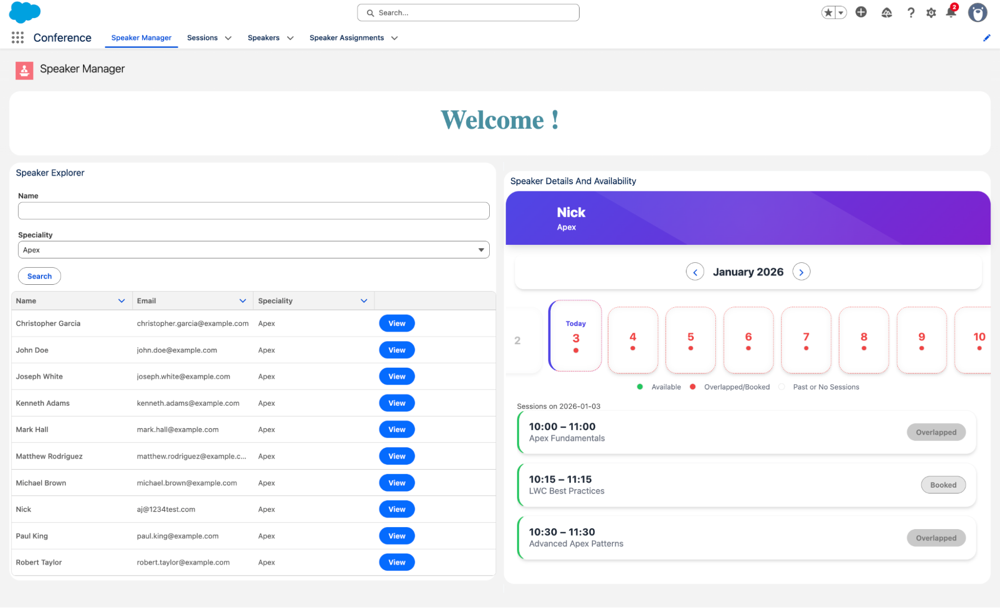

# Speaker Session Management

## 📌 Overview

# 💡 Business Use Case

Conferences and events often have multiple speakers and sessions happening simultaneously. Organizers need a system to manage speaker assignments efficiently, avoid scheduling conflicts, and ensure every session is staffed appropriately. This solution provides a clear way to track speakers, their expertise, and available session slots, making event planning smooth and error-free.

This application allows users to:

* Manage Speakers and Sessions
* Search speakers by name and speciality
* View available session slots
* Book sessions with validation rules enforced
* Ensure data integrity through triggers and Apex logic

---

## 🛠️ Tech Stack


* Apex Classes & Triggers
* Lightning Web Components (LWC)
* Lightning Message Channel
* Custom Objects & Fields
* Validation Rules
* FlexiPages & Lightning App
* GitHub (Version Control)
* Salesforce DX (SFDX)

---

## 📂 Project Structure

```
force-app/main/default
├── applications
├── classes
├── flexipages
├── layouts
├── lwc
├── messageChannels
├── objects
├── profiles
├── tabs
├── triggers
```

---

## 📦 Key Components

### 🔹 Custom Objects

* **Speaker__c**
* **Session__c**
* **Speaker_Assignment__c**

### 🔹 Apex Classes

* `SpeakerSearchController`
* `SpeakerBookingController`
* `SpeakerSlotController`
* `SpeakerAssignmentHandler`

### 🔹 Lightning Web Components

* `speakerSearch`
* `speakerList`
* `bookSession`

### 🔹 Validations & Automation

* Session date must be in the future
* End time must be after start time
* Trigger-based assignment handling
* Test class coverage included


## ✅ Testing

All Apex logic is covered with test classes to ensure reliability and correctness.


---

## ✅ Deployment

The project is structured as a **Salesforce DX project** and can be deployed using:

```bash
sfdx force:source:deploy -p force-app
```

Metadata can also be retrieved or deployed selectively using `package.xml`.

---
## ✅ Image Results

### Speaker View


### Session Availability and Colorful Calendar


### Differentiate overlap/booking status with Colors and Legend


---

## 👤 Author

**Ankem Jagadeeswari**
     

---

## 📄 Notes

* All implementation follows Salesforce best practices.
